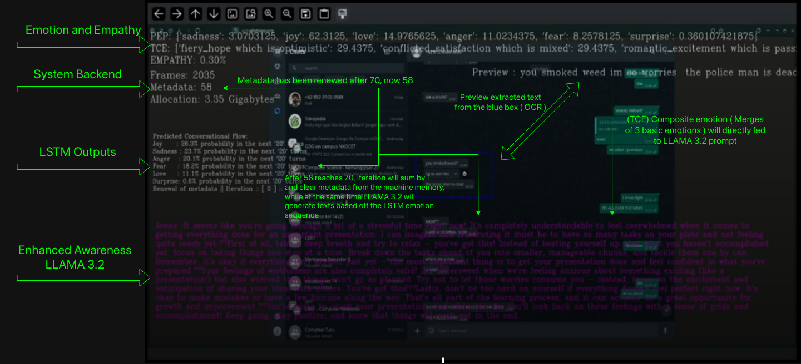

# Technical Demo

# Description
    System-NovaAstra is developed for adequate scalability with no need to use Cloud Computing services. 
    It can run locally on your Laptop or Desktop, provided the hardware meets the requirements.
    The goal is to make a powerful integrated AI system while maintaining transparency and user
    privacy-focused companion.
    
    The system has been optimized and tested using the 'Lowest Specs. Testing'
    specifications (detailed below). For reference, initial hardware specification can be
    found in the 'Initial Testing' section.

    For now, NovaAstra is optimized for machines running on Linux , but still
    needs further development for Windows 11 and MacOS.

    Initial goal of this project is provided as an Open-Source software specifically designed for the
    mental health industry. It is not intended for revenue generation or profit by filling
    the gap of contextual emotional awareness and emotional intelligence found in common chatbots.
    
    Thus, developer sees an opportunity that this project have a potential for alot more diverse use.

# Environment
    DRIVER VERSION: 560.35.03
    CUDA VERSION: 12.6
    CUDA TOOLKIT: Cuda compilation tools, release 12.6, V12.6.85
    PYTHON: 3.12.3
    LIBRARY: (INSTALL PIP **IMPORTANT** USE 'pyenv' DON'T USE ANACONDA)
    RUN : pip install -r requirements.txt
    FOR LINUX OPERATING SYSTEM:

    - Set Kernel Parameter:
    vm.swappiness = 1
    vm.dirty_ratio = 10
    vm.dirty_background_ratio = 5 ~ Minimal Impact

    THIS SOFTWARE IS OPTIMIZED FOR USE ON ADA LOVELACE, HOPPER AND AMPERE GPU ARCHITECTURES.
    THIS SOFTWARE IMPLEMENTS CONCURRENT COMPUTING,
    ENSURE: CPU > 4 CORE > 8 THREAD (RECOMMENDED) | INTEL / AMD. Does not support Apple M-Series
    ENSURE: GPU Uses CUDA CORE (Pytorch Library, Flash Attention (Credit: Tri Dao, Stanford University))
    AMD ROCM not tested yet...

>   # Initial Testing :
    OPERATION SYSTEM: ARCH-LINUX 
    ARCH : x86_64
    COMPOSITOR : WAYLAND with Hyprland WM
    KERNEL: 6.12.9-arch-1-1
    CPU: Ryzen 7 7745HX 8 CORES 16 THREADS
    GPU: NVIDIA RTX 4070 Max-Q 5.888 CUDA CORE 8GB
    RAM: 5200MhZ 8x2GB

>   # Lowest Specs. Testing :
    OPERATION SYSTEM: UBUNTU 24.04.1 LTS 
    ARCH : x86_64 
    COMPOSITOR : WAYLAND with KWin WM
    KERNEL: 6.8.0-50-generic
    CPU: INTEL i3-12100F 4 CORES 8 THREADS
    GPU: RTX 2050 2.048 CUDA CORES 4GB
    RAM: 3200MhZ 1x8GB
    Exclusion : Disable ParlerTTS, 4GB VRAM is not enough for Acoustic Modelling.

>  # Developer Interface (preview)

# Troubleshoot
> For use on Windows 11 Operating System :
> Please check the 'to/your/path' format as it's different from Linux

> For use on X11 Compositor :
> Check OpenCV support, particularly found in os.environment module or
> explicitly set on bash terminal.

# Devs
| Name                  | Affiliation       | Role             | Contact                   |
|-----------------------|-------------------|------------------|---------------------------|
| Rezky Mulia Kam       | BINUS University  | Maintainer       | rezky.kam@binus.ac.id     |
| Juanita G. Bakara     | BINUS University  | Documentation    | juanita.bakara@binus.ac.id|

# Notice
> Due to the need of XAI for this project, we cannot yet ensure its reliability in real world,
> therefore, deploying such tool in production environment is highly not Recommended until further development.
